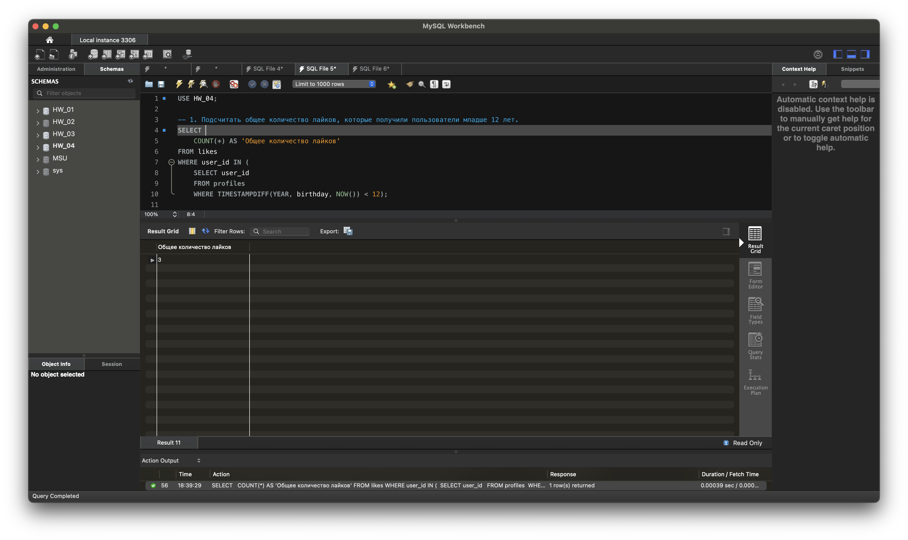
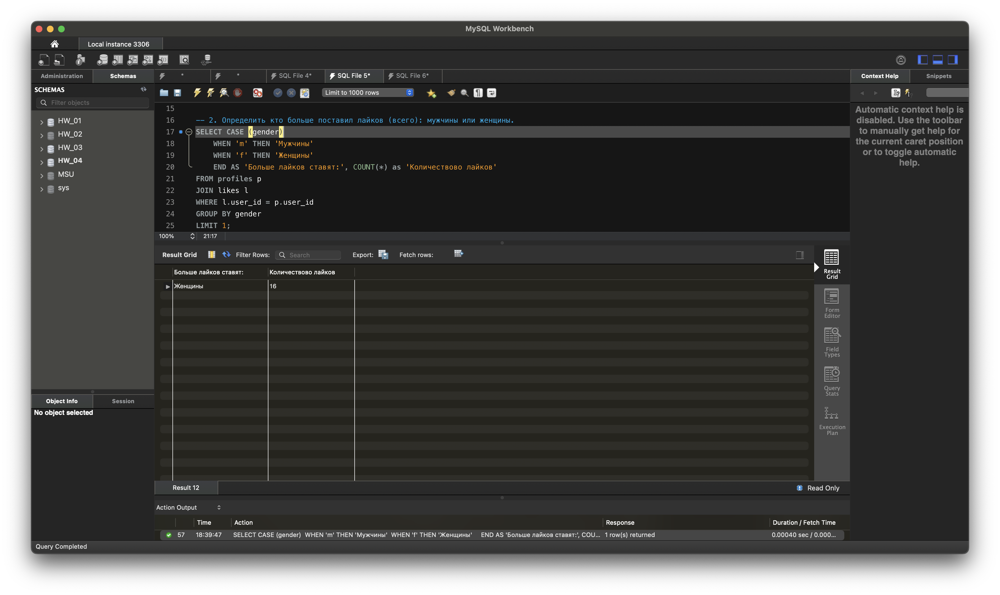
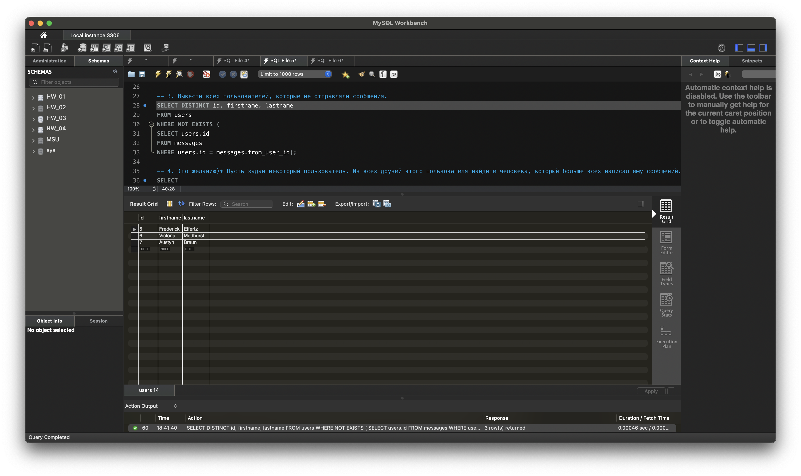
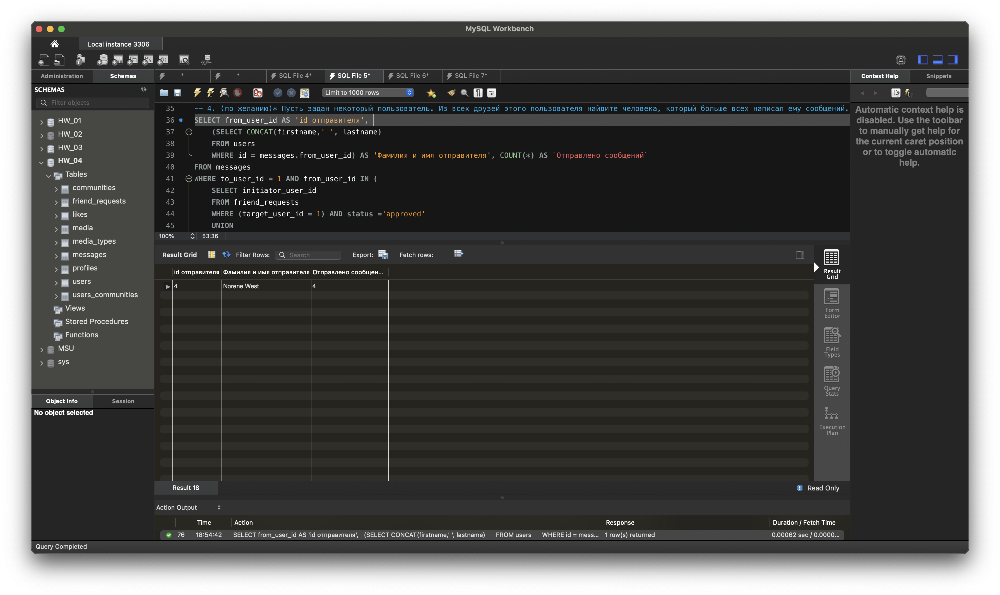

USE HW_04; 

-- 1. Подсчитать общее количество лайков, которые получили пользователи младше 12 лет. 
SELECT  
	COUNT(*) AS 'Общее количество лайков' 
FROM likes 
WHERE user_id IN ( 
	SELECT user_id  
	FROM profiles 
	WHERE TIMESTAMPDIFF(YEAR, birthday, NOW()) < 12); 

-- проверка количества и id пользователей, котороые удовлетворяют условиям 
SELECT * FROM profiles  
WHERE TIMESTAMPDIFF(YEAR, birthday, NOW()) < 12; 

-- 2. Определить кто больше поставил лайков (всего): мужчины или женщины. 
SELECT CASE (gender) 
	WHEN 'm' THEN 'Мужчины' 
	WHEN 'f' THEN 'Женщины' 
    END AS 'Больше лайков ставят:', COUNT(*) as 'Количествово лайков' 
FROM profiles p  
JOIN likes l  
WHERE l.user_id = p.user_id 
GROUP BY gender  
LIMIT 1; 
    
-- 3. Вывести всех пользователей, которые не отправляли сообщения. 
SELECT DISTINCT id, firstname, lastname 
FROM users 
WHERE NOT EXISTS ( 
SELECT users.id 
FROM messages 
WHERE users.id = messages.from_user_id); 

-- 4. (по желанию)* Пусть задан некоторый пользователь. Из всех друзей этого пользователя найдите человека, который больше всех написал ему сообщений. 
SELECT from_user_id AS 'id отправителя',  
	(SELECT CONCAT(firstname,' ', lastname)  
    FROM users  
    WHERE id = messages.from_user_id) AS 'Фамилия и имя отправителя', COUNT(*) AS `Отправлено сообщений` 
FROM messages  
WHERE to_user_id = 1 AND from_user_id IN ( 
	SELECT initiator_user_id  
    FROM friend_requests  
    WHERE (target_user_id = 1) AND status ='approved' 
    UNION 
    SELECT target_user_id  
    FROM friend_requests  
    WHERE (initiator_user_id = 1) AND status ='approved'  
) 
GROUP BY from_user_id 
ORDER BY `Отправлено сообщений` DESC  
LIMIT 1; 
